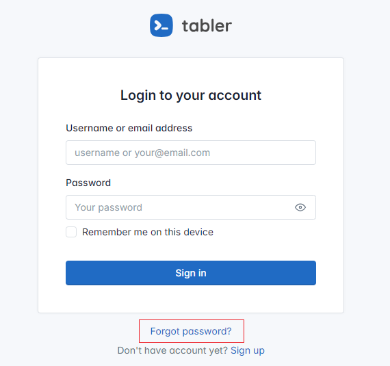

# List of contents  
- [Getting Started](#getting-started)  
  - [Requirements](#requirements)  
  - [Installation](#installation)  
- [Configurations](#configurations)
  - [Remove index.php Section](#remove-indexphp-section)
  - [Change Site Name (App Name)](#change-site-name-app-name)
  - [Change Site/Base Url](#change-sitebase-url)
  - [Create The Database and Tables](#create-the-database-and-the-tables)
  - [Database Configurations](#database-configurations)
  - [Auth Configurations](#auth-configurations)
  - [Email Configurations](#email-configurations)
  - [Cookie Configurations](#cookie-configurations)
- [Miscellaneous](#miscellaneous)
  - [Authentication Features](#authentication-features)
    - [Register](#register)
    - [Login](#login)
    - [Remember Me](#remember-me)
    - [Email Verification](#email-verification)
    - [Reset Password](#reset-password)
  - [CSRF Protection](#csrf-protection)
  - [Helpers](#helpers)
    - [Auth Helper](#auth-helper)
    - [Custom Helper](#custom-helper)
    - [Extended Form Helper](#extended-form-helper)  
  
  
## Getting Started  
### Requirements  
- PHP 7 (I haven't tested with PHP 8 yet).
- MySQL 5.7  

### Installation  
Clone this repository:  
`git clone https://github.com/dikalasepi/ci3-auth-starter-kit.git `  
  
Copy the `ci3-auth-starter-kit` directory to your web server directory. For example if you use XAMPP you can place to **htdocs** directory. If you use LAMP or LEMP, place the directory to **/var/www**. You are free to rename the directory.
  
## Configurations  
The configuration files are placed inside **config** directory. This app need you to configure some files which are:  
- auth.php
- config.php
- database.php
- email.php  

### Remove index.php Section  
The default url that's used by Codeigniter 3 is like this:  
`your-website-name/index.php/controller-name/method`  

If you use Apache web server, you can remove the index.php section by creating a **.htaccess** file within your app directory. You can follow [Removing the index.php file](https://codeigniter.com/userguide3/general/urls.html).  
  
After that, go to **config.php** file and change `$config['index_page']` bellow:  
```
/*
|--------------------------------------------------------------------------
| Index File
|--------------------------------------------------------------------------
|
| Typically this will be your index.php file, unless you've renamed it to
| something else. If you are using mod_rewrite to remove the page set this
| variable so that it is blank.
|
*/
$config['index_page'] = 'index.php';
```  
Remove the value so it becomes:  
```
$config['index_page'] = '';
```

On Nginx I haven't tried yet, because I use Laragon for development.  
  
### Change Site Name (App Name)  
To change the name of the app, you can change the **config.php** file, at this section:  
```
/*
|--------------------------------------------------------------------------
| App Name
|--------------------------------------------------------------------------
| This configuration to set your application name.
|
*/
$config['app_name'] = 'CodeIgniter 3 Auth';
```
  
### Change Site/Base Url  
Still in the **config.php** file, replace the section bellow with your own url:  
```
$config['base_url'] = 'http://your-site-url';
```  
  
### Create The Database and The Tables  
This application uses three tables which are:  
- `users`, for storing user account.
- `user_cookies`, for storing user cookies.
- `access_tokens`, for storing tokens.
  
This is the structure of each table:  
```
mysql> desc users;
+------------+--------------+------+-----+-------------------+----------------+
| Field      | Type         | Null | Key | Default           | Extra          |
+------------+--------------+------+-----+-------------------+----------------+
| id         | int(11)      | NO   | PRI | NULL              | auto_increment |
| unique_id  | varchar(255) | NO   | UNI | NULL              |                |
| full_name  | varchar(60)  | NO   |     | NULL              |                |
| username   | varchar(20)  | YES  |     | NULL              |                |
| email      | varchar(50)  | NO   | UNI | NULL              |                |
| password   | varchar(255) | NO   |     | NULL              |                |
| created_at | timestamp    | NO   |     | CURRENT_TIMESTAMP |                |
| is_active  | tinyint(1)   | NO   |     | 0                 |                |
+------------+--------------+------+-----+-------------------+----------------+

mysql> desc user_cookies;
+-----------------+--------------+------+-----+-------------------+-------+
| Field           | Type         | Null | Key | Default           | Extra |
+-----------------+--------------+------+-----+-------------------+-------+
| id              | varchar(255) | NO   | PRI | NULL              |       |
| email           | varchar(50)  | NO   |     | NULL              |       |
| token           | varchar(255) | NO   |     | NULL              |       |
| is_browser      | tinyint(1)   | YES  |     | NULL              |       |
| is_mobile       | tinyint(1)   | YES  |     | NULL              |       |
| browser_name    | varchar(30)  | YES  |     | NULL              |       |
| browser_version | varchar(20)  | YES  |     | NULL              |       |
| mobile_device   | varchar(30)  | YES  |     | NULL              |       |
| device_platform | varchar(30)  | YES  |     | NULL              |       |
| expiration_date | datetime     | NO   |     | NULL              |       |
| created_at      | datetime     | NO   |     | CURRENT_TIMESTAMP |       |
+-----------------+--------------+------+-----+-------------------+-------+

mysql> desc access_tokens;
+-----------------+--------------+------+-----+-------------------+-------+
| Field           | Type         | Null | Key | Default           | Extra |
+-----------------+--------------+------+-----+-------------------+-------+
| email           | varchar(50)  | NO   | PRI | NULL              |       |
| token           | varchar(255) | NO   |     | NULL              |       |
| expiration_date | datetime     | NO   |     | NULL              |       |
| created_at      | datetime     | NO   |     | CURRENT_TIMESTAMP |       |
+-----------------+--------------+------+-----+-------------------+-------+
```    
  
We have included the database file (**database.sql**) in this repository.  
  
### Database Configurations  
Configure the database by changing configurations in **database.php** file. Change the value of **hostname**, **username**, **password**, and **database** according to yours.
```
$db['default'] = array(
	'dsn'	=> '',
	'hostname' => 'YOUR_HOSTNAME',
	'username' => 'YOUR_USERNAME',
	'password' => 'YOUR_PASSWORD',
	'database' => 'YOUR_DATABASE',
	'dbdriver' => 'mysqli',
	'dbprefix' => '',
	'pconnect' => FALSE,
	'db_debug' => (ENVIRONMENT !== 'production'),
	'cache_on' => FALSE,
	'cachedir' => '',
	'char_set' => 'utf8',
	'dbcollat' => 'utf8_general_ci',
	'swap_pre' => '',
	'encrypt' => FALSE,
	'compress' => FALSE,
	'stricton' => FALSE,
	'failover' => array(),
	'save_queries' => TRUE
);
```  
  
### Auth Configurations 
Auth configurations is placed in the **auth.php** file inside the config directory. There are four configurations that you have to set.
```
$config['auth_register'] = true;
$config['auth_reset'] = true;
$config['auth_verify'] = true;
$config['auth_token_expiration'] = 60 * 5;     // 5 minutes in seconds
```  
- `config['auth_register']` - whether you want to use registration feature or not. The default value is true. Set it to false if you don't want to use this feature.  
- `config['auth_reset']` - whether you want to use reset password feature or not. The default value is true. And if it is true, then you **must** set `auth_verify` to be true. If you don't want to use this feature set it to false.  
- `config['auth_verify']` - whether yout want to use email verification feature or not. The default value is true. Set it to false if you don't want to use this feature.  
- `config['auth_token_expiration']` - the expired time of token that will be used to verify email or reset password. The default value is 5 minutes. You can change it according to your preference.  
  
For more information, please check [Authentication Features](#authentication-features).  
  
### Email Configurations  
The email configurations is located at **email.php** file which is inside the config directory.  
```
$config = array(
    'protocol' => 'smtp',
    'smtp_host' => 'YOUR_SMTP_HOST',
    'smtp_port' => YOUR_SMTP_PORT,
    'smtp_user' => 'YOUR_SMTP_USERNAME',
    'smtp_pass' => 'YOUR_SMTP_PASSWORD',
    'crlf' => "\r\n",
    'newline' => "\r\n",
    'email_from' => 'YOUR_EMAIL_ADDRESS_NAME',
    'email_alias' => 'YOUR_NAME'
);
```  
The configurations that you have to change are:
- `smtp_host`
- `smtp_port`
- `smtp_user`
- `smtp_pass`
- `email_from`
- `email_alias`  
  
### Cookie Configurations  
This cookie configuration is used with **Remember Me** feature. It determines the cookie duration. This configuration is placed in **config.php** file.  
```
$config['cookie_expiration']    = 60 * 60 * 24 * 7;  // 7 days in seconds
```
The default value is 7 days. You are free to change the value according to your preference.  
  
For additional configuration, please set `config['sess_expiration']` which is located at the same file.  
```
$config['sess_expiration'] = 0;             // default: 7200
```  
**0** means the session will be kept until the browser is closed. If you don't use **Remember Me** feature, you can change the value so when the session is expired, the application will be automatically logged out.
## Miscellaneous  
### Authentication Features  
#### Register  
Register is feature for user to manually sign up via register page. If you activate this feature, there will be a sign up link on the login page. If user click that link it will direct to the registration page.  
  
  
  
#### Login  
This is the main feature. And it is the main page that will be served to user if the user hasn't been authenticated yet.  
 
  
The login feature use username or email to verify and authenticate. If you enable `auth_verify` setting, and your email hasn't been verified, then you will get failure login message like this:  
 

#### Remember Me  
Remember Me is an auto login mechanism so you don't have to sign in every time you access the application. It works by adding cookies to the user browser. For security, the cookies are stored in the database server and we hash the cookie's token.  
  
If you enable this feature, then there will be a checkbox input.  
   
  
#### Email Verification  
Email Verification is a feature to send email message to the user and it is used alongside with register and reset password features.  
  
When user click the verify email link, an email message will be sent to the user and then the user is redirected to an information page.  
  
  
The email message contains a link button with identity (email) and token. When user click the button, then the identity and token will be verified by server.  
  
  
If the verification fails or the token is expired, an information page will be displayed.  
  
  
If the verification is successful, the user will be redirected to login page.  
  
  
If you want to change the email message views, you can change the views that are located in `/views/email` directory.  
- `verification.php` is a message view for verifying email.
- `verification-change-email.php` is a message view for verifying email changes.
- `reset.php` is a message view for resetting password.  

#### Reset Password  
Reset Password is a feature for user who forget their password. If this feature is enabled, a forgot password link will be displayed on the login page.  
  
  
Then the user must provide the email address. If your email is already registered an has been verified, an email message for resetting password will be sent.  
  
  
### CSRF Protection  
This application use CSRF protection. So, if you create a form view, make sure you add CSRF name and CSRF token within your form. To add the csrf name and csrf token, simply add this code bellow:  
```
<input type="hidden" name="<?= csrf_name(); ?>" value="<?= csrf_value(); ?>">
```  
If you don't want to use CSRF Protection, you can change the configuration in **config.php** file:  
```
$config['csrf_protection'] = TRUE;    // set this to FALSE
```
  
**Note:**  
There is a bug when using csrf protection on an ajax request. For now, we just exclude the ajax url request. You can add the excluded urls in this section:  
```
/** 
 * This configuration bellow is needed 
 * to allow ajax requests without provide csrf token. 
 */
$config['csrf_exclude_uris'] = array('user/profile', 'user/profile/check_password');
```  
  
### Helpers  
This application use some helpers to make development easier.  
  
#### Auth Helper  
This is a set of functions that is related with the authentication process. It's named `auth_helper.php` and it's located inside `helpers` directory.  
  
#### Custom Helper  
This is a set of functions which are act as a shortcut of another functions. It's named `custom_helper.php` and it's located inside `helpers` directory.  
  
#### Extended Form Helper  
This helper is extended from Codeigniter form helper. We just add some functions as a shortcut. It's named `MY_form_helper.php`.